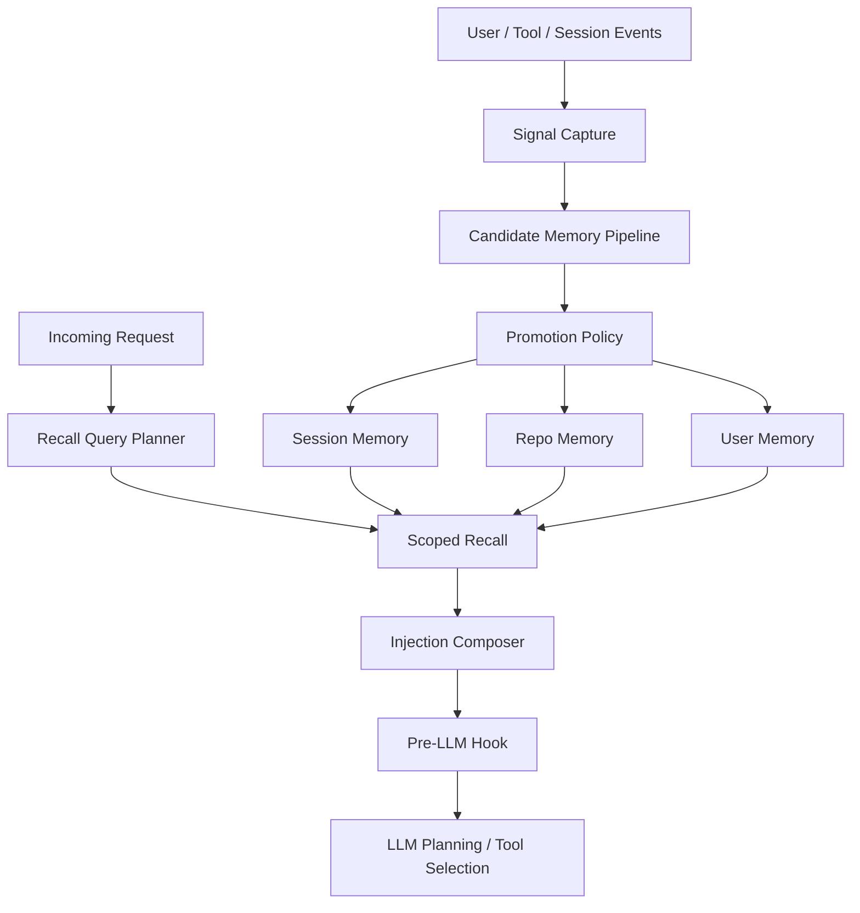

# 通用记忆沉淀设计：相似问题经验与用户偏好

日期：2026-04-20  
状态：Draft / Ready for review

## 1. 背景

当前仓库已经具备三类与 memory 相关的基础能力：

- 持久化 memory store 与 memory tools；
- session 持久化与恢复；
- 面向 prompt 注入的 memory / RAG 接口雏形。

但系统仍缺一个关键闭环：**把运行中的有效经验自动沉淀成可复用记忆，并在后续相似问题中稳定消费**。

这导致两类常见问题：

1. 对相似问题，模型会重复从错误路径开始试错；
2. 用户偏好只能零散体现在当前对话中，无法稳定进入后续决策。

以天气查询为例，系统可能已经在本轮会话里验证过：

- 某需要鉴权的天气 API 不可用；
- 某公开天气 API 返回稳定；

但下一次相似请求仍会从失败 API 开始尝试，说明当前 memory 更多停留在“工具能力”层，而不是“自动沉淀 + 自动召回”的决策层。

## 2. 本阶段目标

本设计目标是建立一套**通用记忆沉淀机制**，同时处理两类信息：

- 相似问题的经验复用；
- 用户偏好的长期沉淀。

本阶段希望达成：

1. 把用户行为、工具结果、纠正信息统一抽象为可沉淀信号；
2. 将信号先变成候选记忆，再根据证据晋升为长期记忆；
3. 按 session / repo / user 三层范围管理记忆；
4. 在每次新请求开始前做 query-aware recall，只注入少量高价值记忆；
5. 支持冲突、衰减、降级、归档，避免 memory 污染；
6. 与现有 persistent memory、session store、hook、prompt assembler 边界兼容。

## 3. 非目标

本阶段明确不做：

- 一次性接入所有信号类型；
- 用复杂 embedding / reranker 替代规则型第一版 recall；
- 让所有原始工具日志直接成为 prompt 内容；
- 把审批缓存与通用经验记忆合并为同一领域模型；
- 在第一版就做复杂运营后台或可视化治理台；
- 将 UI transcript 层当作记忆事实源。

## 4. 设计原则

### 4.1 先候选、后晋升

任何自动沉淀都不得直接写成长期结论。  
所有信号先进入 candidate memory，再经过评分、去重、冲突判断后晋升。

### 4.2 分层治理

记忆必须天然区分：

- session：短期、低成本、容忍噪声；
- repo：项目级稳定经验；
- user：跨项目的长期偏好。

### 4.3 query-aware recall

memory 的价值不在于“存下来了”，而在于**相似问题到来时能被正确召回**。  
召回必须基于当前请求的任务语义，而不是简单全文搜索。

### 4.4 不让低置信经验伪装成硬规则

低置信或高时效信息，只能以 observation 或 preferred strategy 进入注入内容；  
只有高置信、稳定结论才允许进入 hard constraints。

### 4.5 事实源优先来自 canonical execution path

信号采集优先接在 tool lifecycle、execution event、session event 和用户输入上；  
不从 UI 展示层回推 memory 事实。

## 5. 作用域与记忆类型

### 5.1 Scope

| Scope | 作用 | 典型内容 | 生命周期 |
|---|---|---|---|
| `session` | 当前线程内快速复用 | 本轮成功/失败 API、临时约束 | 短 |
| `repo` | 当前仓库跨会话复用 | 项目级工具偏好、稳定解法 | 中 |
| `user` | 跨项目长期偏好 | 中文回复、简洁输出、代码风格偏好 | 长 |

### 5.2 Kind

| Kind | 说明 | 示例 |
|---|---|---|
| `preference` | 用户显式或稳定偏好 | 优先中文回复 |
| `tool-outcome` | 工具成功/失败经验 | `wttr.in` 在天气查询中成功 |
| `solved-pattern` | 某类问题最终采用的稳定方案 | 当前仓库查询天气优先公开 API |
| `constraint` | 必须遵守的硬限制 | 某 API 需要鉴权，不可默认尝试 |
| `correction` | 用户纠正或最新反证 | 旧 API 已失效，应停止优先使用 |

## 6. 总体架构

该架构分成四层：

1. `Signal Capture`：采集事实；
2. `Candidate Memory Pipeline`：归一化、去重、聚合、打分；
3. `Promotion Store`：按 scope 晋升、降级、归档；
4. `Recall & Injection`：在新请求开始前做 query-aware 注入。

## 7. 核心领域模型

### 7.1 MemorySignal

`MemorySignal` 是系统中最原始的可沉淀事实，不直接进入长期 memory。

建议字段：

- `signal_id`
- `signal_type`：user_preference / user_correction / tool_result / task_outcome / repeated_pattern
- `session_id`
- `workspace`
- `source_kind`
- `source_id`
- `summary`
- `payload`
- `timestamp`

### 7.2 CandidateMemory

`CandidateMemory` 表示待观察、待晋升的经验。

建议字段：

- `candidate_id`
- `scope_suggestion`
- `kind`
- `fingerprint`
- `summary`
- `evidence`
- `confidence`
- `freshness`
- `decay_policy`
- `promotion_state`
- `conflict_set`

### 7.3 PromotedMemory

`PromotedMemory` 是真正可被 recall 消费的结论。

建议字段：

- `scope`
- `kind`
- `fingerprint`
- `summary`
- `details`
- `status`：candidate / accepted / competing / superseded / archived
- `confidence`
- `usage_count`
- `last_used_at`
- `expires_at`

## 8. 信号采集与候选沉淀

### 8.1 首批纳入的信号类型

第一版只接三类高价值信号：

1. 用户显式偏好；
2. 工具成功 / 失败结果；
3. 用户纠正。

这样足以覆盖：

- 相似问题的 API 选择经验；
- 用户语言、输出风格、交互偏好。

### 8.2 工具结果的候选生成

对于工具结果，不直接写长期记忆，而是先生成候选：

- 成功一次：生成 `tool-outcome` candidate；
- 失败一次：生成 competing candidate 或 constraint-like candidate；
- 多次重复成功 / 失败：提升 confidence；
- 高时效工具结果默认带 TTL。

以天气查询为例：

- `amap weather` 失败 -> 生成失败候选；
- `wttr.in` 成功 -> 生成成功候选；
- 若同类查询再次复现，则 `wttr.in` 候选强化并具备 repo 晋升资格。

## 9. recall 与 prompt 注入

### 9.1 请求归一化

新请求到来时，先抽取一组 recall query 维度：

- `task_type`
- `domain`
- `action_shape`
- `workspace_context`
- `user_preference_signals`

而不是直接用原始 user message 做全文搜索。

### 9.2 分层召回顺序

默认优先级：

- `tool-outcome`: session > repo > user
- `preference`: user > repo > session
- `solved-pattern`: repo > session > user
- `correction`: 最新证据优先

### 9.3 注入槽位

注入内容分成三类：

1. `Hard Constraints`
2. `Preferred Strategies`
3. `Recent Validated Observations`

示例：

- Hard Constraints：某接口默认不可尝试；
- Preferred Strategies：类似天气查询优先免鉴权公开接口；
- Recent Observations：本会话中 `wttr.in` 成功，高德天气接口失败。

### 9.4 注入预算

建议默认限制：

- hard constraints：最多 2 条；
- preferred strategies：最多 3 条；
- observations：最多 3 条；
- 总字符预算：600 到 1200 字。

## 10. 冲突、置信度与晋升策略

### 10.1 冲突关系

定义三类关系：

- `reinforce`：新证据强化旧记忆；
- `compete`：新证据与旧记忆竞争，但不足以替代；
- `supersede`：新证据已足够稳定，可取代旧记忆。

### 10.2 置信度

建议使用规则型评分：

$$
score = w_e \cdot evidence + w_f \cdot freshness + w_r \cdot repeatability + w_s \cdot scopeFit - w_c \cdot conflictPenalty
$$

其中：

- `evidence`：证据强度；
- `freshness`：时间衰减后的新鲜度；
- `repeatability`：跨回合、跨会话的重复验证程度；
- `scopeFit`：与目标 scope 的匹配度；
- `conflictPenalty`：与高分旧记忆冲突时的扣分。

### 10.3 晋升规则

- session：大多数候选都可先进入；
- repo：需要重复证据、与当前 workspace 强相关、且无更强冲突；
- user：只接受显式长期偏好或跨仓库稳定模式。

### 10.4 降级与归档

- tool-outcome：强衰减；
- solved-pattern：中衰减；
- preference：弱衰减；
- 长期不命中或被反证压过的记忆转为 `superseded` / `archived`。

## 11. 现有仓库的接线方式

### 11.1 继续复用的底座

继续复用：

- `harness/runtime_features.go` 中的 persistent memories 安装；
- `harness/runtime/memory.go` 中的 memory store 与 memory tools；
- session store 与 TUI / one-shot 恢复链路；
- hook / observer / prompt assembler 基础设施。

### 11.2 新增的核心模块

建议新增最小模块集：

- `MemorySignalCollector`
- `CandidateMemoryService`
- `PromotionPolicy`
- `RecallService`
- `PromptInjectionAdapter`

这些模块应位于统一的应用服务层，不应散落在 TUI 或工具渲染逻辑中。

### 11.3 事实源位置

优先从 canonical execution path 采集：

- tool lifecycle / tool result；
- user message / user correction；
- session lifecycle；
- execution observer 事件。

不建议从 transcript 渲染层逆向生成记忆，因为该层容易随着 UI 风格变化产生漂移。

## 12. 渐进落地顺序

### Phase 1：打通最小闭环

- session scope candidate；
- 用户显式偏好；
- 工具成功 / 失败；
- 简单 recall；
- pre-LLM 注入。

目标：同一线程内，相似问题不再重复从错误路径开始试。

### Phase 2：repo scope 晋升

- candidate 聚合；
- repo promotion；
- repo recall；
- superseded / archived 状态流转。

目标：同一仓库跨会话复用稳定经验。

### Phase 3：user scope 长期偏好

- user promotion；
- 跨仓库稳定偏好；
- 用户偏好优先级治理。

### Phase 4：高级治理

- 批量 consolidation；
- 离线 cleanup；
- embedding / semantic recall 增强；
- 调试与治理面板。

## 13. 风险与控制

| 风险 | 表现 | 控制方式 |
|---|---|---|
| 误记 | 偶然成功被写成长期策略 | 先 candidate，后 promotion |
| 过度注入 | prompt 被低价值记忆撑爆 | 固定预算 + 分槽位注入 |
| 冲突污染 | 新旧记忆相互打架 | conflict set + superseded 状态 |
| scope 污染 | 仓库经验误升为用户偏好 | 按 kind 设不同 promotion policy |

## 14. 测试与观测

### 14.1 测试层级

1. 规则层测试：
   - candidate 去重；
   - confidence 计算；
   - reinforce / compete / supersede；
   - promotion / demotion / archive。

2. 运行时集成测试：
   - 工具成功 / 失败后能否生成 candidate；
   - recall 是否按 scope 正确召回；
   - 注入长度是否受预算控制；
   - session 恢复后 repo memory 是否仍可命中。

3. 行为测试：
   - 相似天气问题第二次是否减少错误 API 尝试次数；
   - 用户偏好在后续回合是否稳定命中；
   - 相似任务的首个工具命中率是否上升。

### 14.2 推荐观测指标

- `candidate_created_total`
- `candidate_promoted_total`
- `candidate_superseded_total`
- `recall_hits_total`
- `recall_injected_chars`
- `similar_task_first_tool_success_rate`
- `repeated_user_correction_rate`
- `tool_retry_count_before_success`

## 15. 建议提交拆分

### Commit 1

主题：memory signal 与 candidate pipeline 基础设施

范围：

- 新增 `MemorySignalCollector`；
- 新增 candidate memory 模型与聚合规则；
- 基础规则层测试。

### Commit 2

主题：session / repo recall 与 prompt injection

范围：

- recall query planner；
- pre-LLM 注入适配；
- query-aware recall 回归测试。

### Commit 3

主题：promotion policy、冲突治理与行为验证

范围：

- repo / user promotion policy；
- supersede / archive 流转；
- 相似任务行为测试与指标补齐。

## 16. 验收标准

阶段完成后应满足：

1. 同一线程内，相似问题的重复错误尝试次数明显下降；
2. 同一仓库跨会话，相似问题能稳定复用已验证策略；
3. 用户显式偏好在后续回合命中率足够高；
4. prompt 注入长度受控，不显著放大 token 成本；
5. memory 不因偶然成功或单次失败产生长期污染。

## 17. 最终结论

推荐用一条统一流水线替代当前“memory 工具可用，但缺少自动沉淀闭环”的模式：

> 事件采集 → 候选记忆 → 晋升治理 → query-aware recall → 结构化注入

这套机制既能处理相似问题的经验复用，也能处理用户偏好沉淀，并且与当前仓库已经存在的 persistent memory、session persistence、hook、prompt assembler 边界兼容。